# 语法纠错整理

## 任务定义

语法纠错任务（Grammar Error Correction，GEC）是当前自然语言处理领域一个比较重要的下游任务，它被认为是机器翻译任务的姐妹任务。

它的任务定义为：**给一个包含语法错误的句子，要求纠正句子中的错误，并返回其语义相同的自然语言表示**。

+ 任务输入：包含语法错误的句子，包含$m$个单词。
+ 任务输出：不包含语法错误的句子，包含$n$个单词。

其中，$m$与$n$不需要相等。一个典型的语法纠错实例如下图所示：
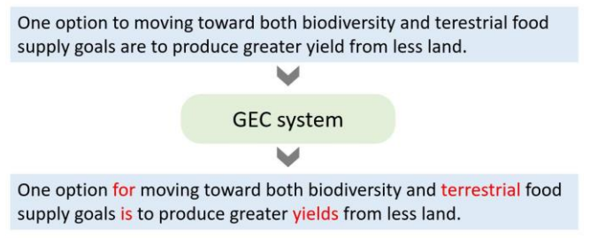

## 发展历程

2000年左右是语法纠错任务的起步阶段，由于当时机器学习、深度学习发展尚未成熟，所以这一阶段的语法纠错大多是通过**手工定义的规则（rule）**实现的。然而，语法错误种类繁多，光靠手工定义规则，不仅费时费力，性能也比较糟糕。尽管目前手工定义的规则仍可作为一些GEC模型的辅助手段，但大体来说这一方法已被人们所淘汰。

2005-2010年，这一阶段，出现了**基于分类（classification）的GEC模型**。通过设计特征对句子中某一位置的上下文进行表示，基于分类的模型尝试根据这一表示选取当前位置最有可能的候选词。但是，由于这一方法往往只能纠正有限类别的错误，并且受限于语言的灵活性，所以目前用的也不多。但近年来也有一些将它与深度学习模型结合的工作。

2010年以后，**以机器翻译模型为基础的GEC模型**逐渐成为主流。深度学习时代来临以前，研究人员大多专注于研究**基于统计机器翻译（SMT）的GEC模型**，但这一方法往往需要人工定义特征，性能一般。2014年以后，几乎所有的GEC模型都采用了神经网络，它们又被称为**基于神经机器翻译（NMT）的GEC模型**。它属于一种序列到序列（seq2seq）模型，将GEC问题看作是“**从一句有语病的句子翻译为一句没有语病的句子**”的翻译问题。

2019年开始，研究人员逐渐发现了基于神经机器翻译的GEC模型的种种弊端，于是，**基于序列到编辑（seq2edit）的模型**开始登上舞台。它属于一种序列标注模型，通过预先定义一些编辑动作，采用神经网络为句子的token打上编辑标签，从而进行语法纠错。目前，**该方法达到了GEC任务的SOTA。**

考虑到上述模型需要大量人工标注的平行语料，研究人员们也提出了一种**基于语言模型的GEC方案**。

## 数据集

目前而言，GEC这个任务还是非常缺少数据集的。与机器翻译任务不同，它的数据标注工作需要标注者具有良好的语言学知识。现有的英文数据集有以下几类：**NUCLE数据集、FCE数据集、Lang-8数据集、JFLEG数据集、W&I+LOCNESS数据集**。它们的详细信息如下表所示：

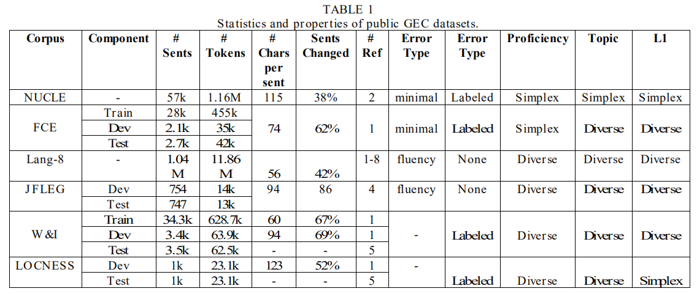

其中，fluency和minimal的Error Type代表了要纠正的错误类型是仅考虑语法错误的还是要额外考虑句子流畅性的。Proficiency代表了文章写作者的熟练程度是否多样。L1代表了文章写作者的母语是否多样。

中文方面，GEC的数据集更加稀缺，主要的资源来自于**NLPCC2018和IJCNLP2017两个公开任务**。

此外，GEC模型由于涉及到语言模型、预训练模型、数据增强等，也可能使用到一些无标签的单语语料，如：**Wikipedia、Gigaword等。**

## 数据标注问题 

在GEC领域，最常用的数据标注方法是**Error-Coded方法**。该方法需要标注：**1）语法错误上下文的范围；2）语法错误类型；3）对应的纠正方案。**

在Error-Coded标注方法中，**最常用的标注格式是M2格式**，如下图所示：

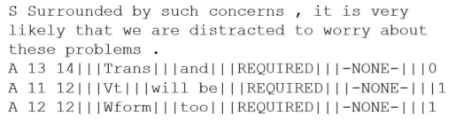

该格式需要标注语法错误的起始位置和结束位置、错误类型、纠正、标注者ID等信息。

但是，现在也有一些研究人员提出Error-Coded标注方案容易受到错误类型变化大、标注者水平参差不齐的影响，所以往往需要较多人员同时标注。另一种标注方向则是**直接将整个句子重写（fluency boosting rewriting）**。

## 开放任务

目前，大多数英文研究都围绕两个公开任务展开，分别是：**1）CoNLL2014；2）BEA-2019**。它们都要求开发者纠正所有类型的语法错误。

它们当前的榜单情况如下：

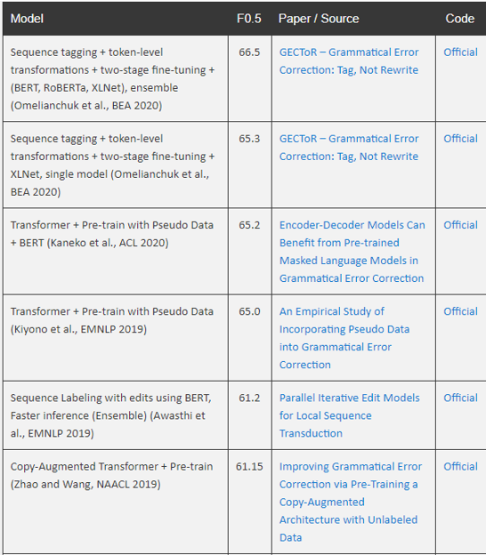

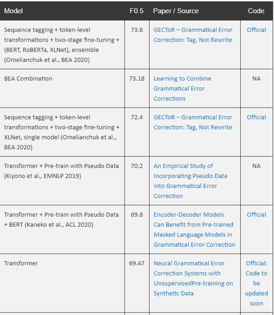

而中文GEC领域的研究工作大都集中在**NLPCC2018任务**上。

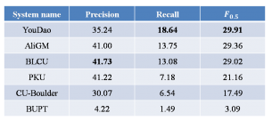

## 模型

### 基于规则的模型

基于规则的GEC模型是早期常用的模型，但它有着显而易见的弊端：**1）构建规则费时费力；2）制定规则需要研究人员具有丰富的语言学知识；3）普适性的规则几乎不存在**。

因此，基于规则的方案目前已经很少有人在用了，所以本文在此不对它进行详细的介绍。

### 基于分类的模型

基于分类的GEC模型的基本做法是：**训练一个多类别分类器，根据当前句子位置的上下文特征（采用特征模板或者深度学习模型抽取），从困惑集中（Confusion Set）中选择此位置最大概率的候选单词**。

此方法可以直接在单语语料上进行训练（个人感觉有点像Word2Vec的CBOW模型），所以**不需要大规模的平行语料**，这点是它的一个优势。

然而，此方法**需要针对特定类型的错误设计特定的特征集合，会受到语言的灵活性影响，且往往只能纠正几种语法错误，速度较慢，性能也一般。**尽管近年来，有研究人员将此方法与深度学习模型相结合，取得了一些进展，但总体而言，该方法在当下已经不再常用，所以本文也不详细介绍了。

### 基于统计机器翻译的模型

在深度学习兴起之前，常见的GEC模型大都基于统计机器翻译（SMT）模型构建。

基于机器翻译（Machine Translation）的模型将语法纠错任务看作是一个从有语法错误的句子翻译为无语法错误的句子的翻译问题。**给定一个有语法错误的句子$x$，此模型旨在找到一个无语法错误的句子$y$，最大化条件概率$p(y|x)$。**

该方法常用的几种模型如下：

+ 基于**单元重排（Unit Reordering）**的翻译模型。这个模型是机器翻译任务中最基础的模型之一。
+ 基于**噪音通道（Noisy Channel）**的翻译模型。该模型通过**贝叶斯公式**，将求解${\underset{y}{argmax}}\,p(y|x)$转化为求解${\underset{y}{argmax}}\,p(x|y)p(y)$，引入了一个**反转翻译模型**（$p(x|y)$）和一个**语言模型**（$p(y)$），从而将这两个模型有效地结合起来。并且，训练语言模型本身不需要平行语料，有丰富的单语语料资源。
+ 基于**对数线性模型（Log-Linear Model）**的翻译模型。这是最常用的一种模型，基于最大熵原理，通过**定义特征函数**，我们可以有效地捕捉源句子中的先验知识和语义信息。

早期的SMT模型只针对特定类别的语法错误，并且没有为GEC任务设置特殊的特征，所以性能较差。随着研究的深入，研究人员开始为此任务设计特定的特征模板，有效地提升了模型的性能。GEC任务常用的稠密特征如下:

+ **编辑距离（Levenshtein Distance）特征**：包括词级别和字级别的编辑距离，非常重要。
+ **编辑操作统计（Edit Operation Counts）特征**：和编辑距离类似，不过会分别统计删除操作、插入操作、替换操作等的距离。
+ **操作序列模型（Operation Sequence Model）特征**。
+ **词级别语言模型（WCLM）特征**。

此外还有一些稀疏的细粒度特征作为辅助，不再介绍。

此外，研究人员也尝试将基于SMT的模型与其他模型相结合，结合的方法通常是**将其他模型（如基于神经机器翻译的模型和基于分类的模型）的输出作为SMT模型的特征**，例如全局词神经网络模型NNGLM和联合神经网络模型NNJM。此外，分类方法能够归纳识别单个错误的类别，处理一些有限类的错误效果较好；而机器翻译方法从平行数据中学习而无需语言学知识输入，更擅长纠正复杂的错误，所以将二者融合可以得到不错的效果。

### 基于神经机器翻译的模型

基于SMT的模型对上下文信息的捕捉能力不足，无法有效地利用全局信息，泛化能力较差，所以它具有性能瓶颈。随着深度学习的兴起，基于神经机器翻译（NMT）的模型逐渐成为主流，它的主要优势在于：**1）直接学习源文本到目标文本的映射，而不需要复杂的特征工程；2）深度神经网络强大的编码器能够有效地捕捉上下文信息，获得全局信息；3）对于训练集中未出现过的句子，也能较好地纠错，泛化能力比基于SMT的方法好。**

基于NMT的模型现在通用两种方案：**1）基于序列到序列（seq2seq）的模型；2）基于序列到编辑（seq2edit）的模型。**

#### 序列到序列的模型

##### 基于RNN的工作

在2017年之前，Seq2Seq方法的GEC模型通常采用循环神经网络（RNN）及其变体（LSTM、GRU等）作为编码器和解码器，根据对源文本进行编码表示得到的向量$x$和先前已生成的词$y_1、y_2...$，预测得到当前时间步的最有可能的词。模型基本结构如下图所示：

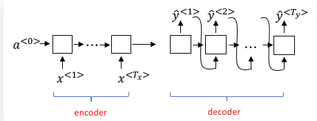

可以看到，RNN模型此时被分为了两个部分：**编码器部分（Encoder）和解码器部分（Decoder）。**

编码器部分没有Softmax层预测输出，它的作用仅仅是**将源语言文本传入到一个RNN网络（具体可以是GRU、LSTM等），然后在网络的出口处提取最后一个时间步的激活值输出，并且传入解码器。**编码器最后一个时间步的激活值输出因为走过了整个源文本序列，所以可以认为**它蕴含了需要纠错的整个句子的信息**。它的维度与RNN单元的隐藏层神经元数目一致。当然了，这里的RNN可以是深层的，但我们只以单隐藏层的RNN进行讲解。

解码器部分可以看作是一个条件语言模型（Language Model，例如我们常见的AI写诗模型）。它的作用是**通过编码器输入的激活值，生成当前条件下最大概率的目标语言句子**。

特别地，我们发现，当词汇表规模很大时，即使是动态规划的维特比算法，求全局最优解时空复杂度也会很高。为了降低计算量，科学家们提出了**集束搜索（Beam Search）**的方法，即第一次输出时选取概率最高的B个单词，并将它们作为输入投入第二个时间步，第二次输出时仍然只选概率最高的B个单词……以此类推，到最后只会产生B条预测序列，我们选取概率最大的的作为最终的结果。**这样做，其实就是在贪心搜索和维特比算法之间进行平衡，当B=1时，集束搜索退化成贪心算法，当B=N时，集束搜索演变成维特比算法。**

上述RNN架构存在着一些问题，例如：**我们用编码器的最后一个时序的激活值输出作为解码器的初始激活值，也就是说编码器的最后一个激活值向量需要承载源句子的所有信息，这在输入的句子长度变长时，容易成为整个模型的“信息”瓶颈。 **

为了解决这个问题，科学家们提出了Attention模型，**它将编码器的每个时序隐藏层直接与解码器每个时序的隐藏层相连接，相等于提供了捷径，解码器的预测可以直接利用编码器在每个源文本单词处的编码结果，从而解决了“信息”瓶颈问题。**

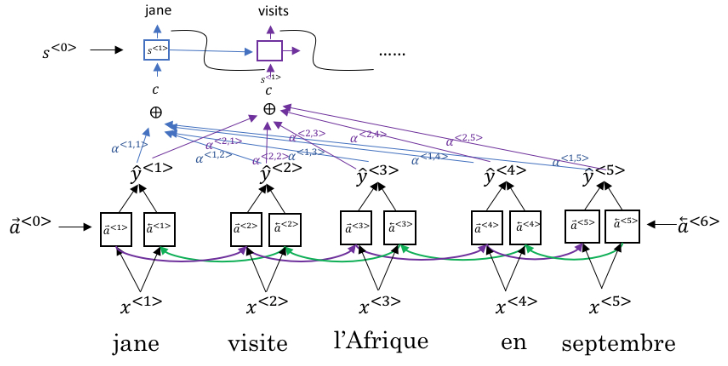

此外，为了解决未登录词的问题，一些科学家还引入了**字级别**的神经网络和Attention机制。

##### 基于CNN的工作

尽管RNN+Attention的模型非常有效，但它同时也存在着一些缺陷。RNN最主要的缺陷在于：**它的计算是有时序依赖的，需要用到前一个时间步或者后一个时间步的信息，这导致它难以并行计算，只能串行计算。**而当今时代，GPU的并行化能够大大加速计算过程，如果不能够并行计算，会导致运算速度很低。

为了解决这个问题，科学家们首先提出了使用CNN代替RNN做特征抽取器。通过多层卷积运算，CNN的上层将能够完整地考虑整个时序的信息。CNN的优势在于可以并行计算，没有时序依赖。但同时它也有一个缺陷：**CNN需要经过多层计算才能获取长序列的资讯，下层CNN只能看到较小的范围。**

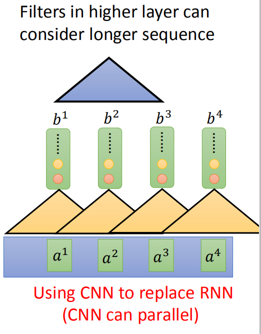

采用CNN的NMT模型，在性能上首次超过了SMT模型。此外，为了获取跨句的上下文信息，一些学者还提出了**跨句**的卷积编码-解码模型用于GEC任务，也同样取得了一定的效果。

##### 基于Transformer的工作

2017年以后，随着Transformer模型的提出，几乎所有Seq2Seq的GEC模型都改用了Transformer架构。**Transformer模型通过采用Self-Attention自注意力机制，完全抛弃了传统RNN在水平方向的传播，只在垂直方向上传播，只需要不断叠加Self-Attention层即可。**这样，每一层的计算都可以并行进行，可以使用GPU进行加速。
Transformer模型最大的创新在于提出了Self-Attention机制，大大加速了运算。

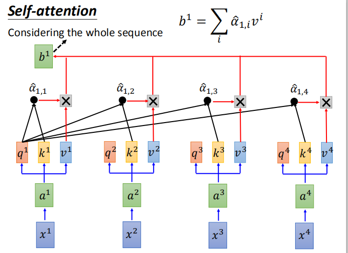

##### 基于Copy机制的工作

研究人员发现：语法纠错任务的一个显著特点是：**目标文本和源文本有大量重复**。

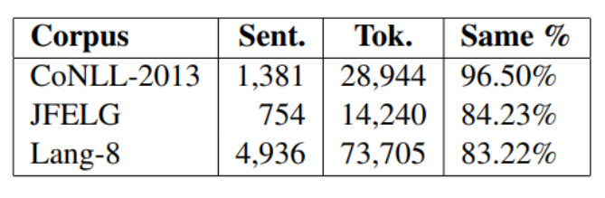

针对这一现象，研究人员提出了Copy-Augment的GEC模型，其主要思想是：**在生成序列过程中，考虑两个生成分布：分别是（1）复制输入序列中的词语的概率分布，（2）从候选词典中的词语生成的概率分布。将两者的概率分布加权求和作为最终生成的概率分布，进而预测每一个时刻生成的词语。**基本架构如下：

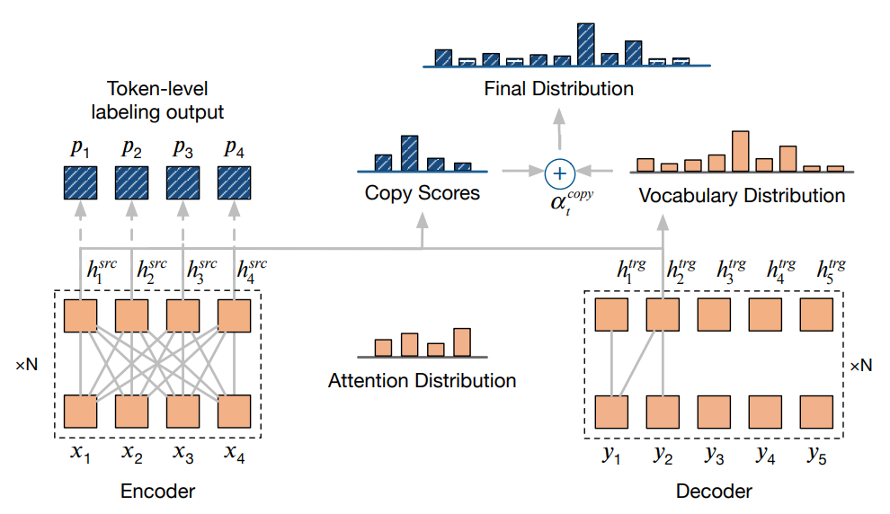

该模型的好处是：

+ 将简单的词语复制任务交给了Copy机制，将模型结构中的Attention等结构更多地用来学习比较难的新词生成。
+ 从源文本中直接复制词语，能有效地**解决OOV问题**。

##### 与语言模型的方法相结合

基于SMT和NMT的模型均可以和基于LM的模型相结合，能够有效提升性能，具体的做法是：

1. 使用大规模单语语料训练N元语言模型（N-Gram）

2. 在NMT模型的Beam-Search解码阶段，需要选择当前概率or得分最高的$B$个句子。此时，可以在得分函数计算中加入语言模型的考量。通常来说，N-Gram语言模型计算出来的句子概率越高，说明句子越流畅、越没有语病。具体修改后的已生成句子得分函数为：
   $$
   s(\hat{y}_{1:k}|x)=logP_{NN}(\hat{y}_{1:k}|x)+{\lambda}logP_{LM}(\hat{y}_{1:k}|x)
   $$
   其中，$\lambda$是一个用来控制语言模型权重的标量。

#### 序列到编辑的模型

基于序列到序列的模型虽然仍然是当下的主流做法，但他往往也存在着许多缺陷，例如：

+ 从头开始一个一个生成单词，**推理速度慢**，无法并行计算。
+ 模型参数较多，**需要大量训练集**。
+ **没有具体的错误位置和错误类型**，只有改正后的结果。

为了解决这一问题，研究人员提出了基于序列到编辑的模型。**与传统的Seq2Seq模型使用ED架构，在解码端重新生成句子不同，Seq2Edit模型只有Encoder，将GEC任务看作是一个序列标注任务，在每个Time-Step预测生成一个编辑动作**。通过使用预测得到的编辑动作对源文本进行转化，我们便可以得到目标文本。

目前较为常用的Seq2Edit模型有PIE、GECToR等。以2019年Awasthi等人的并行迭代编辑（Parallel Iterative Edit, PIE）模型为例，它们使用的编辑动作有：**复制、删除、增加、替换、变形**等。其中，由于增加操作和替换操作需要在候选集中指定单词，所以实际上包含多种编辑操作。总体而言，**Seq2Edit模型的编辑空间远远小于Seq2Seq模型的词汇空间，所以解码空间小了很多**。

此外，PIE模型是非自回归模型，能够并行解码。如下图所示，同传统的NMT模型T2T相比，PIE模型的速度优势巨大：

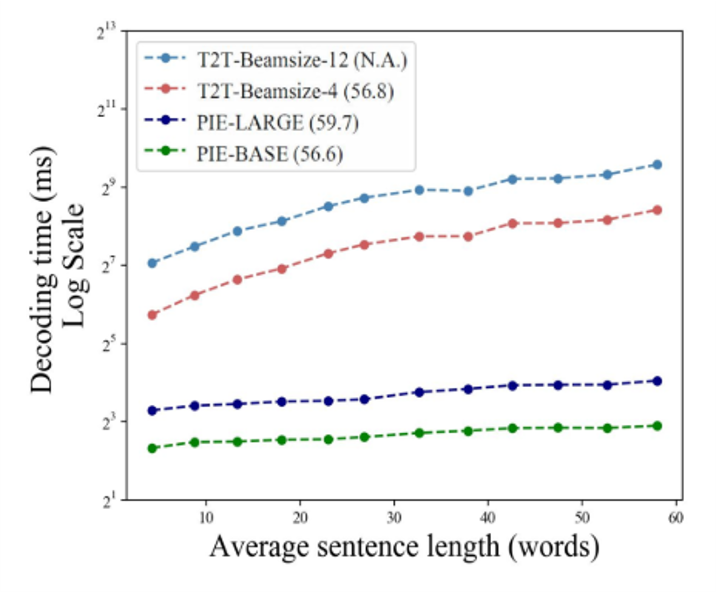

 Seq2Edit的模型不仅速度提升，精度也没有下降。目前，GEC任务的SOTA就是发表在ACL2020的GECToR得到的。

## 性能提升技术

本节描述GEC任务中常用的几种性能提升技术。此外，还有一些广泛应用在机器翻译任务中的性能提升手段可以用在GEC任务上，本节就不进行详细介绍了，例如：**1）对词向量进行DropOut；2）checkpoint average；3）BPE算法；4）领域自适应等。**

### 预训练

**使用预训练模型来初始化我们模型的参数，往往效果会比直接随机初始化参数好很多**。特别地，使用预训练模型**对于低资源任务的帮助更大**，而GEC任务的一个特点就是资源稀缺，所以当下性能较好的GEC模型无一例外都使用了预训练模型。

那么，如何将预训练模型运用到具体的GEC任务中呢？目前，主要有两种方案：

1. 使用**人造的伪平行语料**对我们的GEC模型进行预训练，然后保留所得的模型的参数，再在真实的GEC数据集上进行微调（Fine-tuning）。这里，人造平行语料的方式叫做**数据增强**，我们会在另一节中单独介绍。在这种方法中，预训练阶段和真实训练阶段的模型架构**完全相同**，无需修改。
2. 使用**大规模单语无错误的语料**预训练一个语言模型，如BERT、BART等。保留模型参数，修改模型的结构为GEC模型，最后使用真实的GEC数据集进行微调。

### 重排序

与其它集成在模型内部的性能提升手段不同，重排序（Reranking）更像是模型预测完成之后的一个独立的阶段，所以它被称为一种**后处理方法（post-training）**。它的目的主要是为了解决：**模型预测得分最高的结果，往往并不是最好的结果。**

它的主要做法是：**将GEC模型输出的N个最好的结果作为候选集，使用一些在GEC模型中无法被很好地覆盖但却又较为重要的特征，对这N个最好结果进行重新排序，选取得分最高的结果作为最终的预测结果。**

通过使用重排序方法，我们可以引入丰富的语言学知识，考虑更多全局的特征，还能集成多个GEC模型的输出一起重排序。

常用的重排序特征有：1）语言模型得分；2）编辑距离特征；3）句法特征等。

### 模型集成

模型集成（Model Ensemble）也是当下最为常用的性能提升手段之一，它的做法主要有：1）在Beam-Search解码阶段，将多个模型的输出取平均；2）在输出预测结果阶段，采用多模型投票的方式确定编辑操作等。

但是，模型集成往往会大大增加模型的复杂程度和预测需要的时间，所以只能运用在比赛中，无法落地。

### 迭代纠正

同人类一样，机器对一个句子进行语法纠错往往也无法一次就找到所有的错误，所以，迭代纠正（Iterative Correction）的思想应运而生。这一方法的主要思想是：**对一个含有语病的句子进行多轮纠错，直到评判句子正确程度的某种指标达到指定的阈值。**比较典型的一个例子是微软亚洲研究院在2018年提出的Fluency Boosting模型。

### 修改损失函数

一种更直接的性能提升方式，**是修改模型的损失函数**。

例如：GEC任务中，输出结果的大多数Token与输入文本是相同的，并不重要，而那些产生了差异的Token理应受到更多的关注，所以我们应该提升这些产生差异的Token在损失函数中所占的权重，才能让模型更好地捕捉信息。

## 数据增强

数据增强是目前GEC领域最热门的研究方向之一。由于GEC任务极度缺少平行语料，而人工标注又需要标注者具有良好的语言学知识，十分困难，所以怎么自动生成平行语料理所应当地成为了热点问题。

人工生成的平行语料主要有两种使用方式：**1）直接与真实数据集相合并，一起进行训练；2）先使用人工平行语料对模型进行预训练，再将预训练的模型使用真实数据集进行微调**。由于人工数据的分布往往与真实数据不一致，所以将人工数据用于预训练阶段能够收获更好的性能，当下绝大多数基于神经网络的GEC模型都采用这一方式。

### 噪音生成

噪音生成的思想来自于**预训练阶段常用的降噪自编码器（DAE）**。例如：猿辅导研究院的Wei Zhao等人提出采用随机制造错误数据的方法来构建伪数据，具体流程如下：按照10%的概率随机删除一个词；按照10%的比例随机增加一个词；按照10%的比例随机替换一个词；对所有的词语序号增加一个正态分布，然后对增加正态分布后的词语序号进行重新排序后得到的句子作为错误语句。

噪音生成的具体做法有很多，目前比较好的方法是预先统计真实数据里各类型错误的分布及概率，再根据这一分布生成噪音，从而使人造数据尽可能地接近真实数据地情况。

通过将加入噪音的句子纠正回原本的句子，我们可以以一种无监督的方式对模型进行预训练，这种做法即为降噪自编码器，能有效提升模型性能。

### 反向翻译

反向翻译来源于机器翻译领域，其主要的思想是：**调转已有平行语料的方向，训练一个能从正确句子预测出错误句子的模型，然后用其对大规模无错误语料进行预测，从而得到人造的错误句子。**

### 对抗攻击

## 评价方式（ToDo）

### M2

### GLUE

### ERRANT